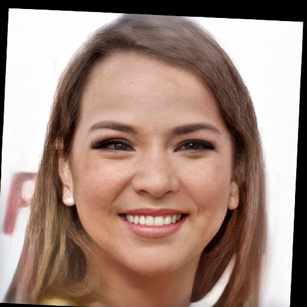
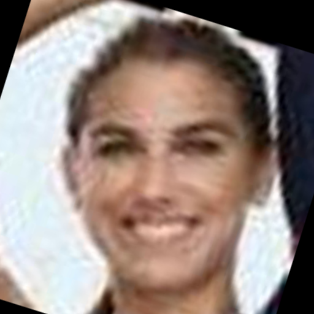
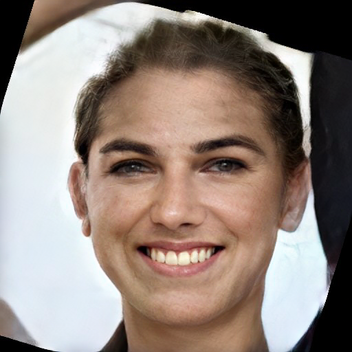

## [Blind Face Restoration via Deep Multi-scale Component Dictionaries](https://arxiv.org/pdf/2008.00418.pdf)

#### __Note: This 'master' branch only contains the face region without putting them into the origial input. You can refer to 'whole' branch for flexible restoration.__ 


<p>
Overview of our proposed method. It mainly contains two parts: (a) the off-line generation of multi-scale component dictionaries from large amounts of high-quality images, which have diverse poses and expressions. K-means is adopted to generate K clusters for each component (i.e., left/right eyes, nose and mouth) on different feature scales. (b) The restoration process and dictionary feature transfer (DFT) block that are utilized to provide the reference details in a progressive manner. Here, DFT-i block takes the Scale-i component dictionaries for reference in the same feature level.
</p>  
    


<p align="center">(a) Offline generation of multi-scale component dictionaries.</p>

<p align="center">(b) Architecture of our DFDNet for dictionary feature transfer.</p>


## Pre-train Models and dictionaries
Downloading from the following url and put them into ./.
- [BaiduNetDisk](https://pan.baidu.com/s/1K4fzjPiezVSMl5NjHoJCGQ) (s9ht)
- [GoogleDrive](https://drive.google.com/drive/folders/1bayYIUMCSGmoFPyd4Uu2Uwn347RW-vl5?usp=sharing)

These folder structure should be:
    
    .
    ├── checkpoints                    
    │   ├── facefh_dictionary                  
    │   │   └── latest_net_G.pth   
    ├── weights
    │   └── vgg19.pth
    ├── DictionaryCenter512
    │   ├── right_eye_256_center.npy
    │   ├── right_eye_128_center.npy
    │   ├── right_eye_64_center.npy
    │   ├── right_eye_32_center.npy
    │   └── ...
    └── ...

## Prerequisites
- Pytorch (≥1.1 is recommended)
- dlib
- [face-alignment](https://github.com/1adrianb/face-alignment)
    ```bash
    cd ./FaceLandmarkDetection
    python setup.py install
    cd ..
    ```
    

## Testing
1. Crop face from the whole image.
```bash
cd ./CropFace
python crop_face_dlib.py
```
###### _(You can change the image path and save path in line 61~62)_

2. Compute the facial landmarks.
```bash
cd ./FaceLandmarkDetection
python get_face_landmark.py
```
###### This code is mainly borrowed from [this work.](https://github.com/1adrianb/face-alignment) You can change the image path and save path in line 17~18. )_

3. Run the face restoration.
```bash
python test_FaceDict.py
```
###### _（You can directly run this code for the given test images and landmarks without step 1 and 2. The image path can be revised in line 100~103.）_

## Some plausible restoration results on real low-quality images

 <table  style="float:center" width=90%>
 <tr>
  <th><B>Input</B></th><th><B>Results</B></th>
 </tr>
 <tr>
  <td>
  
  </td>
  <td>
   
  </td>
 </tr>
 <tr>
  <td>
  
  </td>
  <td>
   
  </td>
 </tr>
 <tr>
  <td>
  
  </td>
  <td>
   
  </td>
 </tr>
 <tr>
  <td>
  
  </td>
  <td>
   
  </td>
 </tr>
 <tr>
  <td>
  
  </td>
  <td>
   
  </td>
 </tr>
  
 </table>

## Citation

```
@InProceedings{Li_2020_ECCV,
author = {Li, Xiaoming and Chen, Chaofeng and Zhou, Shangchen and Lin, Xianhui, Zuo, Wangmeng and Zhang, Lei},
title = {Blind Face Restoration via Deep Multi-scale Component Dictionaries},
booktitle = {ECCV},
year = {2020}
}
```

<a rel="license" href="http://creativecommons.org/licenses/by-nc-sa/4.0/"></a><br />This work is licensed under a <a rel="license" href="http://creativecommons.org/licenses/by-nc-sa/4.0/">Creative Commons Attribution-NonCommercial-ShareAlike 4.0 International License</a>.

