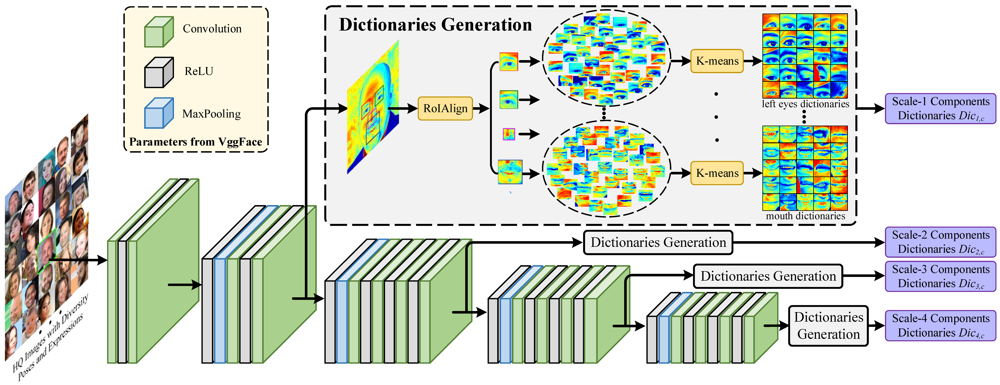
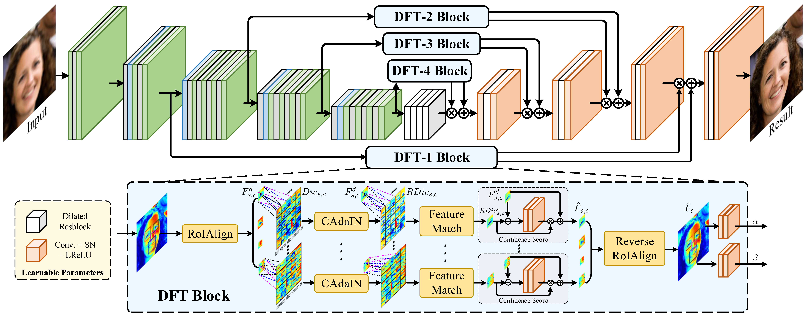
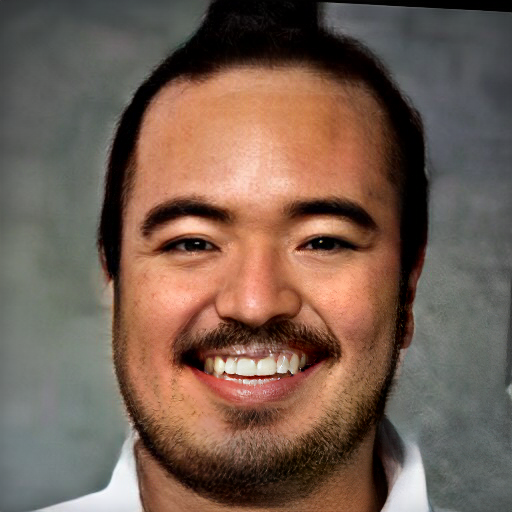
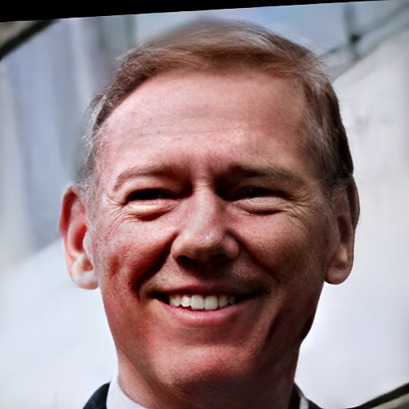
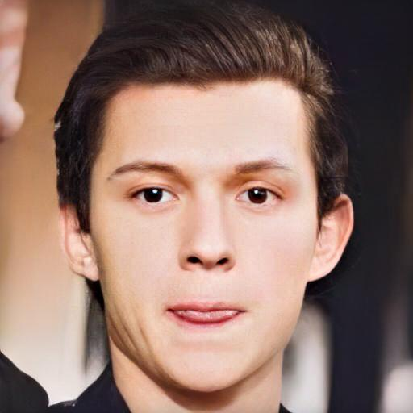
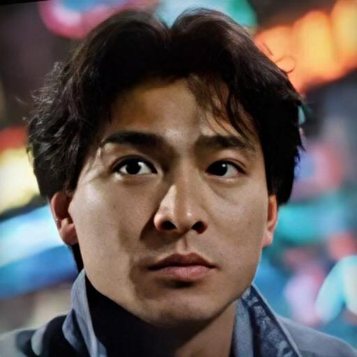
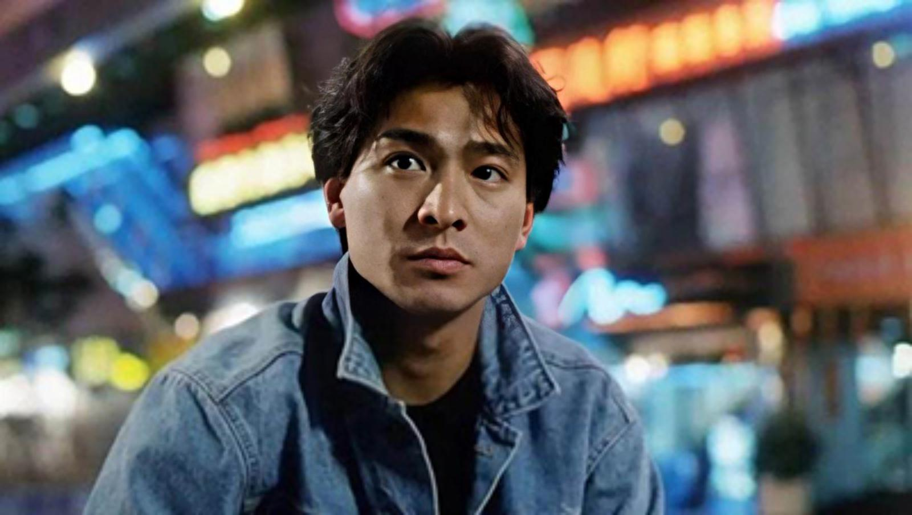
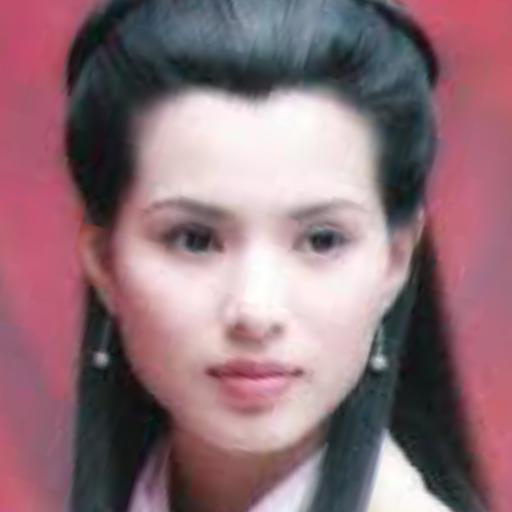
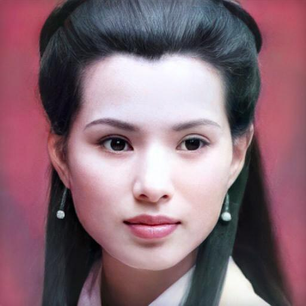
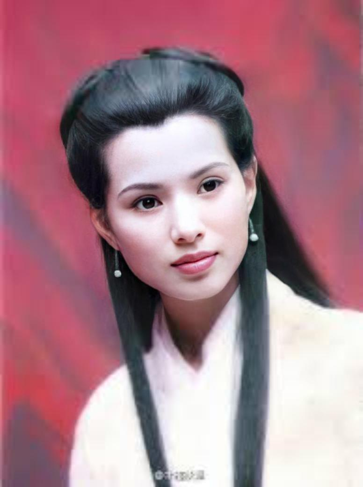

## [Blind Face Restoration via Deep Multi-scale Component Dictionaries](https://arxiv.org/pdf/2008.00418.pdf)

>##### __Note: This branch contains all the restoration results, including 512×512 face region and the final result by putting the enhanced face to the origial input. The former version that can only generate the face result is put in [master branch](https://github.com/csxmli2016/DFDNet/tree/master)__ 


<p>
Overview of our proposed method. It mainly contains two parts: (a) the off-line generation of multi-scale component dictionaries from large amounts of high-quality images, which have diverse poses and expressions. K-means is adopted to generate K clusters for each component (i.e., left/right eyes, nose and mouth) on different feature scales. (b) The restoration process and dictionary feature transfer (DFT) block that are utilized to provide the reference details in a progressive manner. Here, DFT-i block takes the Scale-i component dictionaries for reference in the same feature level.
</p>  
    


<p align="center">(a) Offline generation of multi-scale component dictionaries.</p>

<p align="center">(b) Architecture of our DFDNet for dictionary feature transfer.</p>


## Pre-train Models and dictionaries
Downloading from the following url and put them into ./.
- [BaiduNetDisk](https://pan.baidu.com/s/1K4fzjPiezVSMl5NjHoJCGQ) (s9ht)
- [GoogleDrive](https://drive.google.com/drive/folders/1bayYIUMCSGmoFPyd4Uu2Uwn347RW-vl5?usp=sharing)

The folder structure should be:
    
    .
    ├── checkpoints                    
    │   ├── facefh_dictionary                  
    │   │   └── latest_net_G.pth   
    ├── weights
    │   └── vgg19.pth
    ├── DictionaryCenter512
    │   ├── right_eye_256_center.npy
    │   ├── right_eye_128_center.npy
    │   ├── right_eye_64_center.npy
    │   ├── right_eye_32_center.npy
    │   └── ...
    └── ...

## Prerequisites 
>([Video Installation Tutorial](https://www.youtube.com/watch?v=OTqGYMSKGF4). Thanks for [bycloudump](https://www.youtube.com/channel/UCfg9ux4m8P0YDITTPptrmLg)'s tremendous help.)
- Pytorch (≥1.1 is recommended)
- dlib
- dominate
- cv2
- tqdm
- [face-alignment](https://github.com/1adrianb/face-alignment)
    ```bash
    cd ./FaceLandmarkDetection
    python setup.py install
    cd ..
    ```
    

## Testing
```bash
python test_FaceDict.py --test_path ./TestData/TestWhole --results_dir ./Results/TestWholeResults --upscale_factor 4 --gpu_ids 0 
```
#### __Four parameters can be changed for flexible usage:__
```
--test_path # test image path
--results_dir # save the results path
--upscale_factor # the upsample factor for the final result
--gpu_ids # gpu id. if use cpu, set gpu_ids=-1
```

>Note: our DFDNet can only generate 512&times;512 face result for any given face image.

#### __Result path contains the following folder:__
- Step0_Input: ```# Save the input image.```
- Step1_AffineParam: ```# Save the crop and align parameters for copying the face result to the original input.```
- Step1_CropImg: ```# Save the cropped face images and resize them to 512×512.```
- Step2_Landmarks: ```# Save the facial landmarks for RoIAlign.```
- Step3_RestoreCropFace: ```# Save the face restoration result (512×512).```
- Step4_FinalResults: ```# Save the final restoration result by putting the enhanced face to the original input.```

## Some plausible restoration results on real low-quality images

 <table  style="float:center" width=100%>
 <tr>
  <th><B>Input</B></th><th><B>Crop and Align</B></th><th><B>Restore Face</B></th><th><B>Final Results (UpScaleWhole=4)</B></th>
 </tr>
  <tr>
  <td>
  
  </td>
  <td>
  
  </td>
  <td>
   
  </td>
  <td>
   
  </td>
 </tr>
  <tr>
  <td>
  
  </td>
  <td>
  
  </td>
  <td>
   
  </td>
  <td>
   
  </td>
 </tr>
 <tr>
  <td>
  
  </td>
  <td>
   
  </td>
    <td>
   
  </td>
    <td>
   
  </td>
 </tr>
 <tr>
  <td>
  
  </td>
  <td>
   
  </td>
    <td>
   
  </td>
    <td>
   
  </td>
 </tr>
 <tr>
  <td>
  
  </td>
  <td>
   
  </td>
    <td>
   
  </td>
    <td>
   
  </td>
 </tr>
  
 </table>

## TO DO LIST (if possible)
- [ ] Enhance all the faces in one image.
- [ ] Enhance the background.


## Citation

```
@InProceedings{Li_2020_ECCV,
author = {Li, Xiaoming and Chen, Chaofeng and Zhou, Shangchen and Lin, Xianhui and Zuo, Wangmeng and Zhang, Lei},
title = {Blind Face Restoration via Deep Multi-scale Component Dictionaries},
booktitle = {ECCV},
year = {2020}
}
```

<a rel="license" href="http://creativecommons.org/licenses/by-nc-sa/4.0/"></a><br />This work is licensed under a <a rel="license" href="http://creativecommons.org/licenses/by-nc-sa/4.0/">Creative Commons Attribution-NonCommercial-ShareAlike 4.0 International License</a>.

